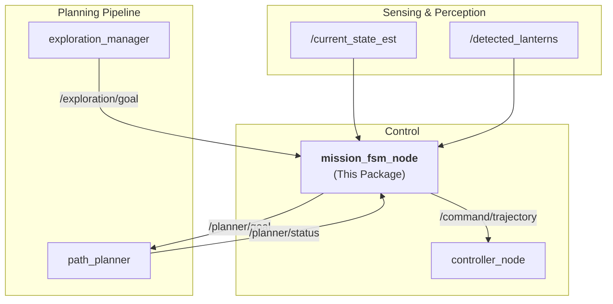
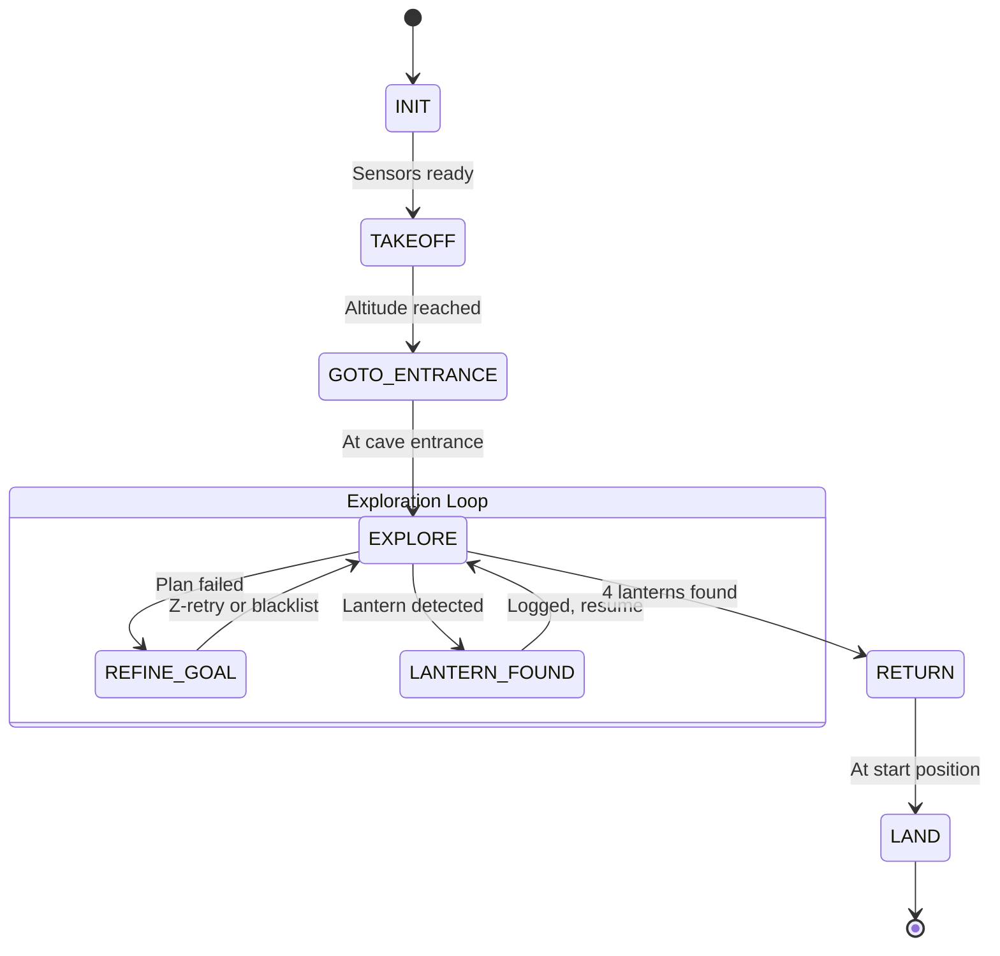
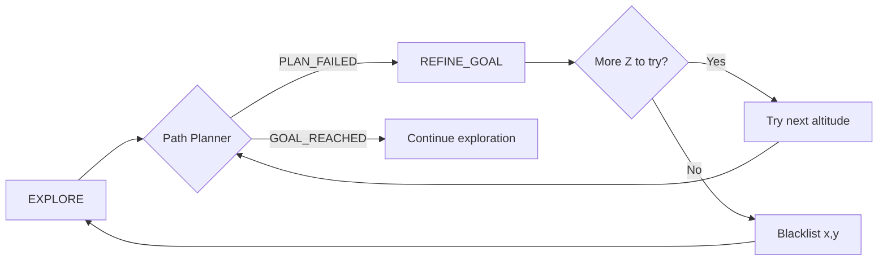

# FSM Package

This package contains the **Mission FSM (Finite State Machine)** that orchestrates the drone's autonomous mission for the SubTerrain Challenge.

## Architecture



## Mission FSM States

The FSM manages the complete autonomous mission through 8 states:



### State Descriptions

| State | Description | Entry Action | Exit Condition |
|-------|-------------|--------------|----------------|
| `INIT` | Wait for sensors | None | Pose data received |
| `TAKEOFF` | Ascend to flight altitude | Publish trajectory to `takeoff_altitude_` | Altitude reached |
| `GOTO_ENTRANCE` | Navigate to cave entrance | Publish trajectory to `cave_entrance_` | Position reached |
| `EXPLORE` | Autonomous exploration | Accept goals from `exploration_manager` | 4 lanterns found |
| `REFINE_GOAL` | Z-altitude retry (recovery) | Try next altitude | All retries exhausted or success |
| `LANTERN_FOUND` | Log detected lantern | Cancel current goal | Immediately return to EXPLORE |
| `RETURN` | Navigate back to start | Publish trajectory to `start_position_` | Position reached |
| `LAND` | Land the drone | Publish trajectory to z=0 | Altitude < 0.2m |

---

## Key Features

### 1. Lantern De-duplication

When a lantern is detected, the FSM checks if it's already been logged:

```cpp
// 2.0 meter threshold - lanterns within this distance are considered duplicates
for (const auto& existing_pose : detected_lantern_poses_) {
    double dist = calculate_distance(msg->pose.position, existing_pose.position);
    if (dist < LANTERN_DEDUP_THRESHOLD) {
        is_new = false;
        break;
    }
}
```

### 2. Z-Retry Recovery (REFINE_GOAL)

When path planning fails (e.g., ceiling too low), the FSM doesn't give up on a good frontier. Instead, it tries different altitudes:

```
Altitude retry sequence: 1.5m → 1.0m → 2.0m → 0.75m → 2.5m
```



### 3. Goal Blacklisting

Goals that fail all Z-retries are blacklisted to prevent infinite loops:

```cpp
// 1.0 meter threshold for blacklist matching
bool is_goal_blacklisted(const geometry_msgs::msg::Point& goal) const {
    for (const auto& blacklisted : blacklisted_goals_) {
        double dist_2d = sqrt(dx*dx + dy*dy);  // XY distance only
        if (dist_2d < BLACKLIST_THRESHOLD) return true;
    }
    return false;
}
```

---

## ROS 2 Interface

### Subscribed Topics

| Topic | Type | Description |
|-------|------|-------------|
| `/current_state_est` | `nav_msgs/Odometry` | Drone pose and velocity |
| `/detected_lanterns` | `geometry_msgs/PoseStamped` | Lantern detections from perception |
| `/planner/status` | `std_msgs/String` | Path planner status (`GOAL_REACHED`, `PLAN_FAILED`) |
| `/exploration/goal` | `geometry_msgs/PoseStamped` | Strategic goals from exploration_manager |

### Published Topics

| Topic | Type | Description |
|-------|------|-------------|
| `/command/trajectory` | `trajectory_msgs/MultiDOFJointTrajectory` | Trajectory commands for controller |
| `/planner/goal` | `geometry_msgs/PoseStamped` | Goals sent to path planner |
| `/fsm/state` | `std_msgs/String` | Current FSM state (for debugging) |
| `/fsm/cancel` | `std_msgs/Empty` | Cancel signal for current goal |

---

## Parameters

| Parameter | Default | Description |
|-----------|---------|-------------|
| `takeoff_altitude` | `2.0` | Target altitude for takeoff (m) |
| `cave_entrance_x` | `10.0` | X coordinate of cave entrance |
| `cave_entrance_y` | `0.0` | Y coordinate of cave entrance |
| `cave_entrance_z` | `2.0` | Z coordinate of cave entrance |

---

## Usage

### Build

```bash
cd ~/git/tum/as/autonomoussystems2025/ros2_ws
source /opt/ros/jazzy/setup.bash
colcon build --packages-select FSM
```

### Run

```bash
source install/setup.bash

# Run directly
ros2 run FSM mission_fsm_node

# Or via launch file
ros2 launch FSM fsm.launch.py
```

### Debug

```bash
# Monitor current state
ros2 topic echo /fsm/state

# Check if goals are being sent
ros2 topic echo /planner/goal

# Simulate a lantern detection
ros2 topic pub /detected_lanterns geometry_msgs/PoseStamped \
  '{header: {frame_id: "world"}, pose: {position: {x: 5.0, y: 3.0, z: 1.0}}}'

# Simulate planner failure
ros2 topic pub /planner/status std_msgs/String '{data: "PLAN_FAILED"}'
```

---

## File Structure

```
FSM/
├── CMakeLists.txt
├── package.xml
├── README.md                  # This file
├── include/
│   └── FSM/
│       └── mission_fsm_node.hpp   # Class definition & MissionState enum
├── src/
│   └── mission_fsm_node.cpp       # FSM implementation
└── launch/
    └── fsm.launch.py              # Launch file
```

---

## Dependencies

- `rclcpp`
- `std_msgs`
- `geometry_msgs`
- `nav_msgs`
- `trajectory_msgs`
- `tf2` / `tf2_ros`
