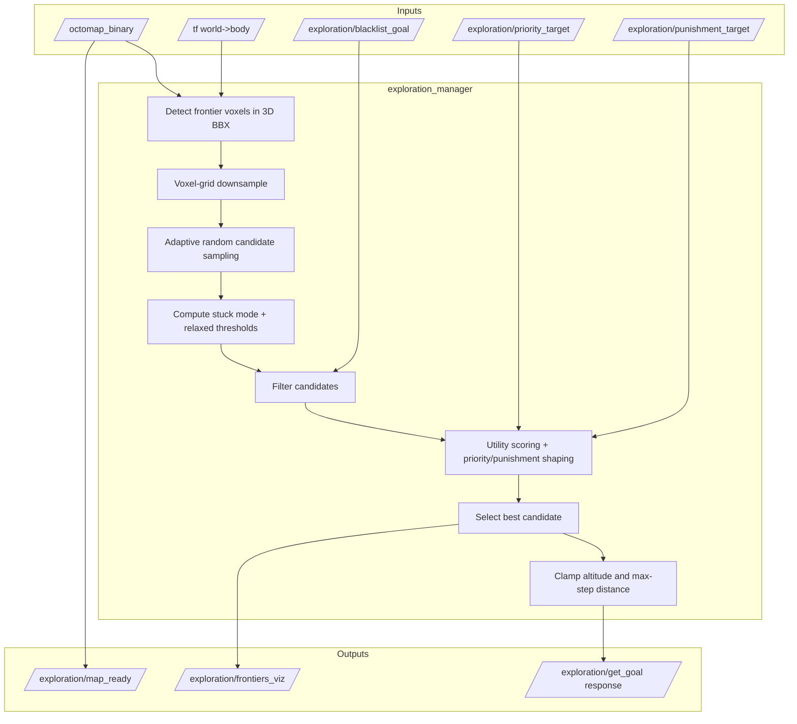

# Exploring Package (`exploring`)

This package provides the `exploration_manager` node, a **3D frontier-goal service** used by the mission FSM. It implements a Dai-Lite sampling pipeline with adaptive stuck handling and FSM-driven priority controls.

---

## 1) What changed in behavior (vs older docs)

The current implementation goes beyond basic frontier scoring:

- Uses **true 3D frontier detection** directly on OctoMap leaf voxels.
- Adds **adaptive stuck-mode relaxation** driven by EWMA rejection statistics.
- Applies **branch-commitment and anti-oscillation logic** (recent-goal hard reject + revisit penalties + heading memory).
- Supports FSM macroplanning inputs:
  - `/exploration/priority_target` (reward area),
  - `/exploration/punishment_target` (one-shot repulsion area).
- Publishes `/exploration/map_ready` once OctoMap is sufficiently populated (>1000 nodes).

---

## 2) Runtime architecture



---

## 3) Goal-generation pipeline

1. **Map/pose guard checks**: requires OctoMap and TF pose.
2. **Frontier detection**:
   - Iterate free leaf voxels in a drone-centered BBX.
   - Frontier = free voxel with at least one unknown 6-neighbor.
   - Search radius expands with consecutive failures.
3. **Downsample + sample**:
   - 3D voxel-grid reduction (`downsample_grid`).
   - Random sample count increases as failures accumulate.
4. **Stuck-mode adaptation**:
   - Track rejection fractions by filter reason with EWMA.
   - Relax one dominant constraint (obstacle / distance / LOS / blacklist).
5. **Filtering**:
   - failed-goal regions and explicit blacklist,
   - obstacle clearance,
   - min goal distance,
   - backtracking rejection (normal mode),
   - cave-boundary guard,
   - recent-goal hard-reject window,
   - LOS check (optionally relaxed for short range in LOS stuck mode).
6. **Utility evaluation**:
   - Time-based utility with vertical penalty and deadband.
   - Directional reward along estimated forward heading.
   - Lateral-over-forward penalty.
   - Branch-commitment reward toward preferred heading.
   - Optional priority reward and punishment suppression fields.
7. **Final shaping**:
   - Reject too-low utility (anti-premature-backtracking threshold).
   - Clamp goal Z near current altitude (`max_goal_z_delta`, plus stuck bonus).
   - Clamp step length (`max_step_distance`) if enabled.

---

## 4) Adaptive stuck handling

Stuck mode activates after `min_stuck_failures` consecutive failures if one filter class dominates EWMA statistics.

- **OBSTACLE**: lower effective obstacle clearance (bounded).
- **DISTANCE**: lower min-goal-distance (bounded).
- **LOS**: allow short-range LOS grazing.
- **BLACKLIST**: shrink blacklist radius (bounded).

On a successful goal, failure counters and EWMA stats are reset.

---

## 5) ROS 2 interfaces

### Subscribed topics

- `/octomap_binary` (`octomap_msgs/msg/Octomap`)
- `/exploration/blacklist_goal` (`geometry_msgs/msg/PointStamped`)
- `/exploration/priority_target` (`geometry_msgs/msg/PointStamped`)
- `/exploration/punishment_target` (`geometry_msgs/msg/PointStamped`)

### Published topics

- `/exploration/frontiers_viz` (`visualization_msgs/msg/MarkerArray`)
- `/exploration/map_ready` (`std_msgs/msg/Bool`) when map node count exceeds 1000

### Service server

- `/exploration/get_goal` (`exploring/srv/GetExplorationGoal`)

---

## 6) Key parameters

### Core sampling and feasibility

- `num_candidates` (default `20`)
- `downsample_grid` (`1.0` m)
- `frontier_search_radius` (`25.0` m)
- `exploration_inflation_radius` (`0.7` m)
- `min_goal_distance` (`3.0` m)
- `max_step_distance` (`1.0` m; `0` disables)
- `min_z` / `max_z` (`0.3` / `50.0`)
- `cave_entrance_x` (`-320.0`)

### Utility shaping

- `drone_speed` (`1.0`)
- `vertical_penalty_weight` (`2.0`)
- `vertical_penalty_deadband` (`1.0`)
- `branch_commitment_weight` (`0.35`)
- `max_branch_bonus` (`0.35`)
- `backtrack_penalty_factor` (`0.55`)

### Oscillation/backtracking guards

- `goal_history_max_size` (`60`)
- `recent_goal_hard_reject_radius` (`2.2`)
- `recent_goal_hard_reject_count` (`12`)
- `revisit_penalty_radius` (`4.5`)
- `revisit_penalty_weight` (`0.85`)
- `backtrack_reject_distance` (`2.5`)
- `heading_update_alpha` (`0.35`)

### Failed-region memory and macroplanning hooks

- `failed_region_merge_radius` (`3.0`)
- `failed_region_base_reject_radius` (`2.0`)
- `failed_region_reject_radius_gain` (`0.7`)
- `failed_region_max_hits` (`6`)
- `priority_target_reached_radius` (`1.0`)
- `priority_target_reward_gain` (`1000.0`)
- `punishment_target_penalty_gain` (`1000.0`)

### Stuck-mode controls

- `min_stuck_failures` (`10`)
- `stuck_fraction_threshold` (`0.5`)
- `stuck_alpha` (`0.25`)
- `los_short_range_threshold` (`6.0`)
- `max_goal_z_delta` (`2.0`)
- `max_goal_z_delta_stuck_bonus` (`2.0`)

---

## 7) Performance logging

Per request, metrics are appended to:

- `/tmp/exploration_performance.csv`

Columns:

```text
timestamp, request_id, total_time_ms, num_voxels_found, num_downsampled,
num_candidates_evaluated, selected_utility, drone_x, drone_y, drone_z,
goal_x, goal_y, goal_z
```

---

## 8) Usage

```bash
ros2 launch fsm mission.launch.py
```

For exploration debugging in RViz, monitor `/exploration/frontiers_viz`.
