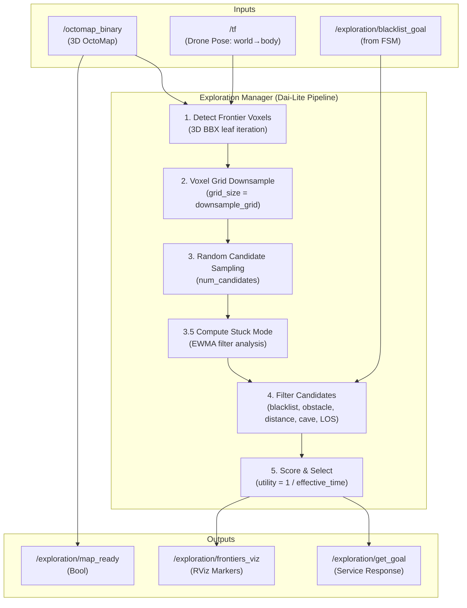

# Exploring Package

This package implements **Dai-Lite Sampling**, a 3D frontier-based exploration strategy for autonomous UAVs in complex underground environments (caves, tunnels).

## Key Features

- **True 3D Frontier Detection**: Identifies frontier voxels (free cells adjacent to unknown space) directly in the full 3D OctoMap using `begin_leafs_bbx`, with no 2D projection or altitude slicing.
- **Voxel Grid Downsampling**: Reduces potentially thousands of frontier voxels into a manageable, spatially uniform set before sampling, ensuring O(1)-like constant-time candidate evaluation.
- **Time-Based Utility Scoring**: Ranks candidates by estimated travel efficiency ($U = 1/T_\text{eff}$) with a forward-progress bias and lateral penalty to drive systematic cave penetration.
- **Adaptive Stuck Detection**: Uses Exponentially Weighted Moving Averages (EWMA) to identify the dominant failure mode and dynamically relax the corresponding safety constraint.
- **Performance Logging**: Logs per-request timing and candidate statistics to `/tmp/exploration_performance.csv`.

---

## Architecture



---

## Algorithm Details

### 1. 3D Frontier Detection

The frontier search uses OctoMap's `begin_leafs_bbx` iterator over a bounding box centered on the drone. A free leaf voxel is classified as a **frontier** if any of its 6 orthogonal neighbors is in unknown space (null OcTree node).

The search radius expands dynamically on consecutive failures:
- Starts at `frontier_search_radius` (default 25 m)
- Grows by 10 m every 5 consecutive failures, up to a 50 m bonus

### 2. Voxel Grid Downsampling

All detected frontier voxels are downsampled into a 3D grid of cell size `downsample_grid` (default 1.0 m). One representative point is kept per cell. This reduces thousands of frontier points to a stable, spatially uniform candidate pool.

### 3. Random Candidate Sampling

`num_candidates` points are drawn uniformly at random from the downsampled pool. The effective sample count increases by 10 per consecutive failure:

```
effective_candidates = num_candidates + (consecutive_failures * 10)
```

### 4. Time-Based Utility Scoring

Each candidate is scored by the estimated inverse travel time, with penalties for altitude change and lateral deviation:

$$U = \frac{1}{T_\text{eff}}$$

$$T_\text{eff} = \frac{d_{3D}}{v_\text{drone}} \times \left(1 + w_z \cdot |\Delta z|\right)$$

Where:
- $d_{3D}$ is the full 3D distance to the candidate
- $v_\text{drone}$ is `drone_speed` (default 1.0 m/s)
- $w_z$ is `vertical_penalty_weight` (default 2.0)
- $|\Delta z|$ is the absolute altitude change

**Forward bonus**: Candidates with `dx < 0` (deeper into cave) are boosted by up to **5×** proportionally to `|dx|`. Candidates with `dx > 0` (retreating) are penalized by **0.1×**.

**Lateral penalty**: If the lateral-to-forward ratio exceeds 1.0, utility is divided by that ratio.

### 5. Candidate Filtering

Each candidate passes through four sequential filters before scoring:

| Filter | Criterion | Dynamic in Stuck Mode |
|--------|-----------|----------------------|
| **Blacklist** | Distance to any blacklisted point < `blacklist_radius` | Radius shrinks 50% at max severity |
| **Obstacle Clearance** | Any occupied voxel within `exploration_inflation_radius` | Clearance reduces to min 0.4 m |
| **Minimum Distance** | 3D distance to drone < `min_goal_distance` | Threshold reduces to min 1.0 m |
| **Cave Boundary** | Candidate x > `cave_entrance_x` (outside cave) | Not relaxed |
| **Line of Sight** | Raycast hits an occupied voxel before candidate | Grazing hits (<1 m from candidate) allowed for short-range goals in LOS stuck mode |

### 6. Goal Clamping and Step Limiting

After the best candidate is selected:
- **Altitude clamping**: Goal Z is clamped to ±2 m of current drone altitude to prevent dangerous vertical excursions.
- **Max step distance**: If `max_step_distance > 0` and the goal exceeds this distance, the goal is linearly interpolated toward the drone to `max_step_distance` meters.

---

## Adaptive Stuck-Mode Detection

When the exploration service fails `min_stuck_failures` or more times consecutively, the system identifies the **dominant filter reason** and relaxes the corresponding constraint.

### EWMA Failure Statistics

After each failed request, the fraction of candidates rejected by each filter is tracked via an EWMA with learning rate `stuck_alpha`:

$$\hat{f}_k = \alpha \cdot f_k + (1-\alpha) \cdot \hat{f}_{k-1}$$

where $f_k$ is the fraction of candidates rejected by filter $k$ in the current request.

### Stuck Mode Activation

Stuck mode is activated when:
1. `consecutive_failures >= min_stuck_failures`
2. The dominant EWMA fraction exceeds `stuck_fraction_threshold`

A **severity** factor interpolates from 0 (at `min_stuck_failures`) to 1 (at `min_stuck_failures + 10`):

```
severity = clamp((consecutive_failures - min_stuck_failures) / 10, 0, 1)
```

### Mode-Specific Relaxations

| Stuck Mode | Trigger | Constraint Relaxed | Range |
|------------|---------|-------------------|-------|
| **OBSTACLE** | Obstacle rejections dominate | `exploration_inflation_radius` | Base → min 0.4 m |
| **LOS** | LOS rejections dominate | Allow LOS grazing hits for goals ≤ `los_short_range_threshold` m | On/Off |
| **DISTANCE** | Distance rejections dominate | `min_goal_distance` | Base → min 1.0 m |
| **BLACKLIST** | Blacklist rejections dominate | `blacklist_radius` | Base → min 0.75 m |

All constraints have **hard lower bounds** to maintain absolute minimum safety. On the first successful goal after a stuck episode, all failure statistics are reset and strict thresholds restored.

---

## ROS 2 Interface

### Subscribed Topics

| Topic | Type | Description |
|-------|------|-------------|
| `/octomap_binary` | `octomap_msgs/Octomap` | 3D occupancy map (latched) |
| `/exploration/blacklist_goal` | `geometry_msgs/PointStamped` | Goals permanently blacklisted by FSM |

### Published Topics

| Topic | Type | Description |
|-------|------|-------------|
| `/exploration/frontiers_viz` | `visualization_msgs/MarkerArray` | Candidate frontiers (cyan) and best goal (green) |
| `/exploration/map_ready` | `std_msgs/Bool` | Emitted once when OctoMap node count exceeds 1000 |

### Service Servers

| Service | Type | Description |
|---------|------|-------------|
| `/exploration/get_goal` | `exploring/GetExplorationGoal` | Returns the best frontier goal given current map and pose |

---

## Parameters

| Parameter | Default | Description |
|-----------|---------|-------------|
| `num_candidates` | `20` | Number of frontier candidates randomly sampled per request |
| `downsample_grid` | `1.0` | Voxel grid cell size (m) for downsampling frontier points |
| `drone_speed` | `1.0` | Assumed drone speed (m/s) for time-based utility scoring |
| `vertical_penalty_weight` | `2.0` | Time dilation factor per meter of altitude change |
| `frontier_search_radius` | `25.0` | Base BBX search radius (m) around drone for frontier detection |
| `min_goal_distance` | `3.0` | Minimum 3D distance (m) from drone to an accepted goal |
| `max_step_distance` | `1.0` | Maximum single-step distance (m); goal is linearly clamped if exceeded. Set to 0 to disable. |
| `exploration_inflation_radius` | `0.7` | Obstacle clearance (m): goals closer than this to any obstacle are rejected |
| `blacklist_radius` | `1.5` | Radius (m) within which a candidate is considered blacklisted |
| `min_frontier_size` | `5` | Minimum frontier cluster size (currently used for filtering, not clustering) |
| `min_z` / `max_z` | `0.3` / `50.0` | Altitude bounds for frontier search |
| `cave_entrance_x` | `-320.0` | X coordinate threshold; candidates with x > this are outside the cave |
| `min_stuck_failures` | `10` | Consecutive failures required to enter stuck mode |
| `stuck_fraction_threshold` | `0.5` | EWMA fraction threshold for a filter to be considered dominant |
| `stuck_alpha` | `0.25` | EWMA learning rate for failure statistics |
| `los_short_range_threshold` | `6.0` | Distance (m) within which LOS grazing hits are tolerated in LOS stuck mode |

---

## Performance

Metrics are logged per-request to `/tmp/exploration_performance.csv`:

```
timestamp, request_id, total_time_ms, num_voxels_found, num_downsampled,
num_candidates_evaluated, selected_utility, drone_x, drone_y, drone_z,
goal_x, goal_y, goal_z
```

---

## Usage

```bash
ros2 launch fsm mission.launch.py
```

**RViz visualization:**
- `/exploration/frontiers_viz` — Cyan spheres: all sampled candidates; Green sphere: selected goal.

---

## File Structure

```
exploring/
├── CMakeLists.txt
├── package.xml
├── README.md
├── srv/
│   └── GetExplorationGoal.srv
├── include/
│   └── exploring/
│       └── exploration_manager.hpp
└── src/
    └── exploration_manager.cpp
```

---

## Dependencies

- `rclcpp`
- `octomap` / `octomap_msgs`
- `geometry_msgs`
- `std_msgs`
- `visualization_msgs`
- `tf2` / `tf2_ros`
