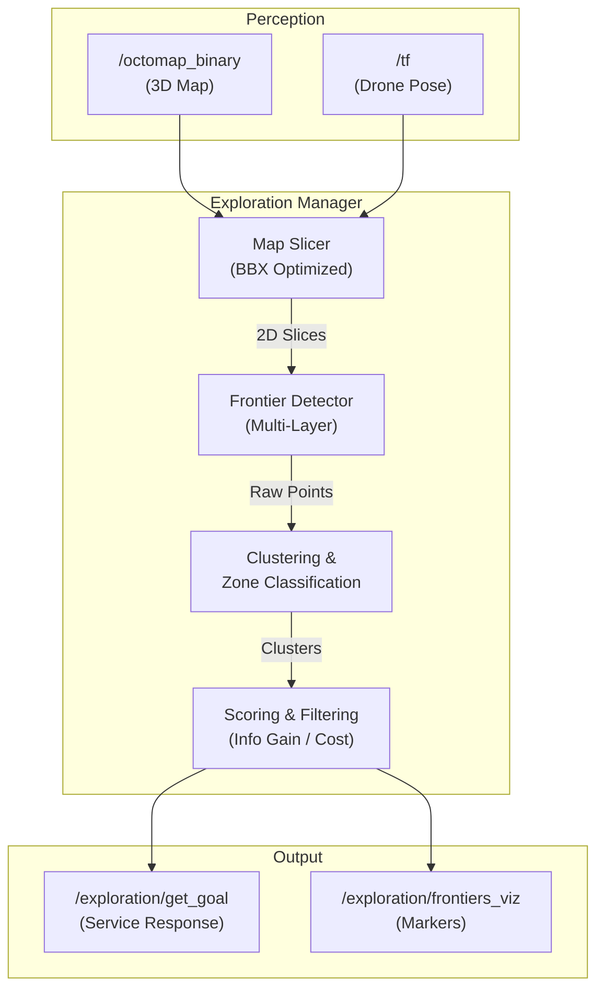

# Exploring Package

This package implements a robust **Multi-Layer Frontier-Based Exploration** strategy for autonomous UAVs in complex 3D environments (caves, tunnels).

## Key Features

- **Multi-Layer 3D Perception**: Slices the 3D OctoMap at multiple altitudes (e.g., drone ± 1m) to find frontiers, allowing discovery of vertical structures.
- **Optimized Performance**: Uses bounding-box leaf iteration to slice maps in **constant time O(1)** (regardless of total map size).
- **Smart Scoring**: Balances information gain vs. travel cost with a **tunable linear penalty** to encourage long-range exploration.
- **Stuck Prevention**: Filters out tiny frontiers within **3m** of the drone to force meaningful progress.
- **Performance Logging**: Tracks detailed metrics (timing, cluster counts) to CSV for analysis.

---

## Architecture



---

## Algorithm Details

### 1. Multi-Layer Slicing
Instead of a single 2D slice, we create a "pancake stack" of slices around the drone's altitude.
- **Layers**: Default 3 (`num_altitude_layers`)
- **Spacing**: 1.0m (`altitude_layer_spacing`)
- **Optimization**: Slices are computed using **bounding-box iteration** (`begin_leafs_bbx`), visiting only voxels in a 20m radius. This makes compute time **constant (~2-3ms)** even for huge maps.

### 2. Scoring Function
Frontiers are scored to maximize information gain while minimizing travel cost.

```cpp
// Information Gain
info_gain = log2(size) * forward_bonus * centerline_bonus

// Travel Cost (Tunable Linear Penalty)
// Default weight 0.05 means 50m cost is ~3.5x (not 10x) of 5m cost
travel_cost = (1.0 + distance_penalty_weight * dist) * vertical_penalty
```

### 3. Stuck Prevention (Min Distance Filter)
To prevent the drone from getting stuck in loops visiting tiny nearby frontiers:
- **Filter**: Any cluster closer than `min_goal_distance` (default **3.0m**) gets a score of 0.
- **Result**: The drone is forced to choose goals at least 3m away, ensuring minimal progress per step.

---

## Parameters

Tunable in `mission.launch.py`:

| Parameter | Default | Description |
|-----------|---------|-------------|
| **`max_step_distance`** | `50.0` | Max distance (m) to a selected goal. |
| **`distance_penalty_weight`** | `0.05` | Controls how much distance hurts score. <br>Lower (e.g. 0.05) = bigger jumps. <br>Higher (e.g. 0.5) = thorough local search. |
| **`min_goal_distance`** | `3.0` | Frontiers closer than this (m) are ignored. Prevents "stuck" behavior. |
| **`slice_window_radius`** | `20.0` | Radius (m) of the local map slice. Smaller = faster compute. |
| **`num_altitude_layers`** | `3` | Number of vertical slices to check. |
| **`altitude_layer_spacing`** | `1.0` | Vertical distance (m) between slice layers. |
| **`min_frontier_size`** | `15` | Minimum number of voxels for a valid cluster. |

---

## Performance Analysis

Performance metrics are logged to `/tmp/exploration_performance.csv`.

| Metric | Unoptimized | Optimized |
|--------|-------------|-----------|
| **Compute Time** | ~20-30s | **~2-3s** (Constant) |
| **Step Size** | ~2-4m | **~10-18m** |
| **Effective Speed** | ~6 m/min | **~11 m/min** |
| **Stuck Episodes** | Frequent | **Zero** |

---

## Usage

**Launch:**
```bash
ros2 launch fsm mission.launch.py
```

**Visualize:**
- **Frontiers**: Red spheres in RViz (`/exploration/frontiers_viz`)
- **Selected Goal**: Green sphere (largest/best score)
- **Map Slice**: 2D grid (`/exploration/map_slice`)

---

## Troubleshooting

**Drone is "stuck" (making tiny movements):**
- Increase `min_goal_distance` to **5.0m**.

**Drone is skipping areas:**
- Increase `distance_penalty_weight` to **0.2** or **0.5**.
- Decrease `max_step_distance` to **30.0m**.

**Compute is too slow (>5s):**
- Decrease `slice_window_radius` to **15.0m**.
- Decrease `num_altitude_layers` to **1**.
