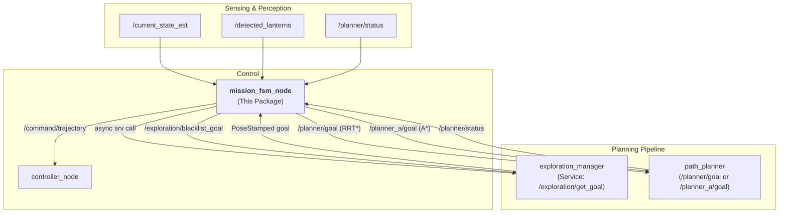
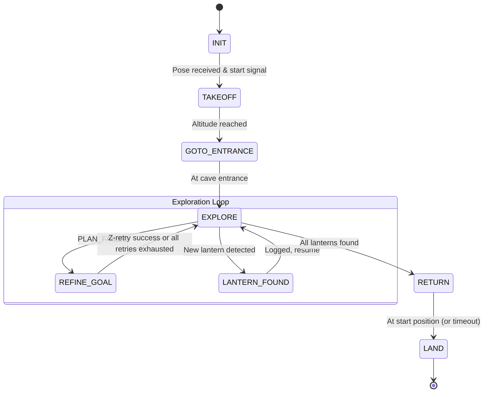
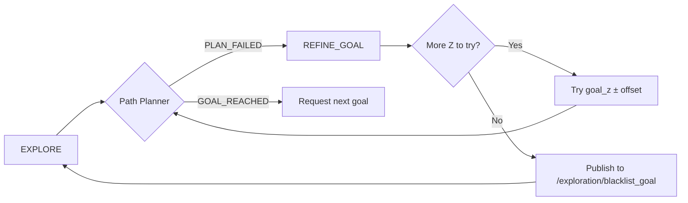

# FSM Package

This package contains the **Mission FSM (Finite State Machine)** that orchestrates the drone's autonomous mission for the SubTerrain Challenge.

## Architecture

The FSM acts as the central coordinator of the system. It consumes state estimates and lantern detections, and drives the planning pipeline by calling the exploration service and dispatching goals to the path planner.



---

## Mission FSM States

The FSM manages the complete autonomous mission through 8 states:



### State Descriptions

| State | Description | Entry Action | Exit Condition |
|-------|-------------|--------------|----------------|
| `INIT` | Wait for system readiness | None | Pose received AND `/mission/start` published |
| `TAKEOFF` | Ascend 5 m above ground | Publish waypoint path | Altitude threshold reached |
| `GOTO_ENTRANCE` | Navigate to cave entrance | Publish path to `cave_entrance_` | Position within `GOAL_REACHED_THRESHOLD` |
| `EXPLORE` | Autonomous frontier exploration | Enable mapping, call exploration service | All lanterns found |
| `REFINE_GOAL` | Z-altitude retry recovery | Re-send same (x,y) at next Z offset | Goal reached, all retries exhausted, or goal timeout |
| `LANTERN_FOUND` | Log newly detected lantern | Cancel current goal | Immediately transitions back to `EXPLORE` |
| `RETURN` | Navigate back to start via planner | Dispatch planner goal to start position | Position reached or 120 s timeout |
| `LAND` | Land the drone | Publish trajectory to z=0 | Altitude < 0.2 m |

---

## Key Features

### 1. Exploration via Service Call

The FSM does **not** subscribe to a topic for exploration goals. Instead, it acts as an asynchronous **service client** that calls `/exploration/get_goal` (`exploring::srv::GetExplorationGoal`) on demand. A pending-request flag prevents duplicate concurrent calls.

```
FSM --[async call]--> /exploration/get_goal --> ExplorationManager
ExplorationManager --[response: PoseStamped]--> FSM
```

The map-ready flag (`/exploration/map_ready`) is checked before the first request, ensuring the OctoMap is populated before goals are requested.

### 2. Planner Selection

The FSM supports two path planners, selected via the `planner_type` parameter:

| `planner_type` | Goal Topic | Algorithm |
|---|---|---|
| `"RRT"` | `/planner/goal` | RRT* |
| `"A_star"` (default) | `/planner_a/goal` | A* |

The same dispatch logic applies in both `EXPLORE` (via the service callback) and `RETURN` states.

### 3. Relative Z-Retry Recovery (`REFINE_GOAL`)

When the path planner reports `PLAN_FAILED`, the FSM transitions to `REFINE_GOAL`. Instead of a fixed altitude sequence, it computes **relative offsets** from the exploration manager's recommended goal altitude:

```
z_retry_altitudes_ = { goal_z, goal_z - 1.0, goal_z + 1.0, goal_z - 2.0, goal_z + 2.0 }
```

Each retry sends the same (x,y) coordinates with the next Z altitude. If all five attempts fail, the goal is **blacklisted** by publishing to `/exploration/blacklist_goal`, and the FSM returns to `EXPLORE` to fetch a new goal.



### 4. Goal Blacklisting via Publisher

When all Z-retries for a goal are exhausted, the FSM publishes a `geometry_msgs/PointStamped` to `/exploration/blacklist_goal`. The `exploration_manager` subscribes to this topic and adds the point to its internal blacklist, preventing the frontier from being suggested again. **No blacklist logic lives inside the FSM itself.**

### 5. Lantern De-duplication

Lantern detections are transformed to the `world` frame before being compared against previously recorded positions. A 2.0m proximity threshold (`LANTERN_DEDUP_THRESHOLD`) prevents the same physical lantern from being counted multiple times.

### 6. Goal Timeout and Stuck Detection

Within `EXPLORE`, every active goal is monitored for:
- **Goal timeout** (`GOAL_TIMEOUT_SECONDS`): If the goal is not reached within the timeout, it is abandoned and a new goal is requested.
- **No movement**: After 10 s, if the drone has moved less than `MIN_MOVEMENT_THRESHOLD`, the goal is abandoned.
- **Goal-selection stuck watchdog**: If goal service calls keep failing (`consecutive_goal_request_failures_` ≥ `explore_goal_selection_max_failures_`) or no successful goal has been dispatched for more than `explore_goal_selection_timeout_` seconds, a warning is emitted.

### 7. Single-Edge Node Recovery (Macroplanning)

When macroplanning identifies that the mission should revisit a **single-edge node**, the FSM now uses a two-phase behavior designed to avoid stale explorer goals:

1. **Travel phase**: travel mode is used only to go to the **predecessor node** of the selected single-edge node.
2. **Priority exploration phase**: once at that predecessor (or already there), travel mode is released and exploration resumes, but with a strong priority signal (`/exploration/priority_target`) aimed at the single-edge node.
3. **Automatic deactivation**: when the drone enters a 1.0 m radius around that node, the priority signal is cleared.
4. **Continuous potential harvesting**: while in `travel` or `potential` execution mode, the FSM still records newly seen macroplanning potential nodes around the currently anchored checkpoint so potential branches are not lost during transit.

This logic is specific to single-edge-node dispatching; other travel-mode uses are unchanged.

---

## ROS 2 Interface

### Subscribed Topics

| Topic | Type | Description |
|-------|------|-------------|
| `/current_state_est` | `nav_msgs/Odometry` | Drone pose and velocity |
| `/detected_lanterns` | `geometry_msgs/PoseStamped` | Lantern detections from perception |
| `/planner/status` | `std_msgs/String` | Path planner feedback (`GOAL_REACHED`, `PLAN_FAILED`) |
| `/exploration/map_ready` | `std_msgs/Bool` | Signal from exploration_manager that map is populated |
| `/mission/start` | `std_msgs/Empty` | Trigger to begin the mission |

### Published Topics

| Topic | Type | Description |
|-------|------|-------------|
| `/command/trajectory` | `trajectory_msgs/MultiDOFJointTrajectory` | Direct trajectory commands (takeoff, land) |
| `/planner/goal` | `geometry_msgs/PoseStamped` | Goals sent to RRT* planner |
| `/planner_a/goal` | `geometry_msgs/PoseStamped` | Goals sent to A* planner |
| `waypoints` | `nav_msgs/Path` | Waypoint path (latched) for trajectory generator |
| `/fsm/state` | `std_msgs/String` | Current FSM state string |
| `/fsm/cancel` | `std_msgs/Empty` | Cancel signal for current goal |
| `/exploration/blacklist_goal` | `geometry_msgs/PointStamped` | Goals to permanently blacklist |
| `/exploration/priority_target` | `geometry_msgs/PointStamped` | High-priority macroplanning target for exploration mode |
| `/fsm/drone_marker` | `visualization_msgs/Marker` | RViz drone position marker |
| `/enable_mapping` | `std_msgs/Bool` | Enables cloud gating when entering EXPLORE |

### Service Clients

| Service | Type | Description |
|---------|------|-------------|
| `/exploration/get_goal` | `exploring/GetExplorationGoal` | Requests the next exploration frontier goal |

---

## Parameters

| Parameter | Default | Description |
|-----------|---------|-------------|
| `planner_type` | `"A_star"` | Path planner to use: `"A_star"` or `"RRT"` |
| `min_exploration_goal_distance` | `2.0` | Minimum 2D distance (m) for accepted exploration goals |
| `explore_goal_selection_timeout` | *(declared)* | Seconds without a successful goal before emitting a stuck warning |
| `explore_goal_selection_max_failures` | *(declared)* | Consecutive service failures before emitting a stuck warning |

> **Note:** The cave entrance position (`[-320.0, 10.0, 18.0]`) and takeoff altitude (`2.0 m`) are currently hardcoded in the constructor.

---

### Debug

```bash
# Monitor current state
ros2 topic echo /fsm/state

# Inspect goals sent to planner
ros2 topic echo /planner_a/goal

# Inspect blacklisted goals
ros2 topic echo /exploration/blacklist_goal
```

---

## File Structure

```
fsm/
├── CMakeLists.txt
├── package.xml
├── README.md
├── include/
│   └── fsm/
│       └── mission_fsm_node.hpp   # Class definition & MissionState enum
├── src/
│   └── mission_fsm_node.cpp       # FSM implementation
└── launch/
    └── mission.launch.py          # Main mission launch file
```

---

## Dependencies

- `rclcpp`
- `std_msgs`
- `geometry_msgs`
- `nav_msgs`
- `trajectory_msgs`
- `visualization_msgs`
- `tf2` / `tf2_ros`
- `exploring` (for `GetExplorationGoal` service type)
