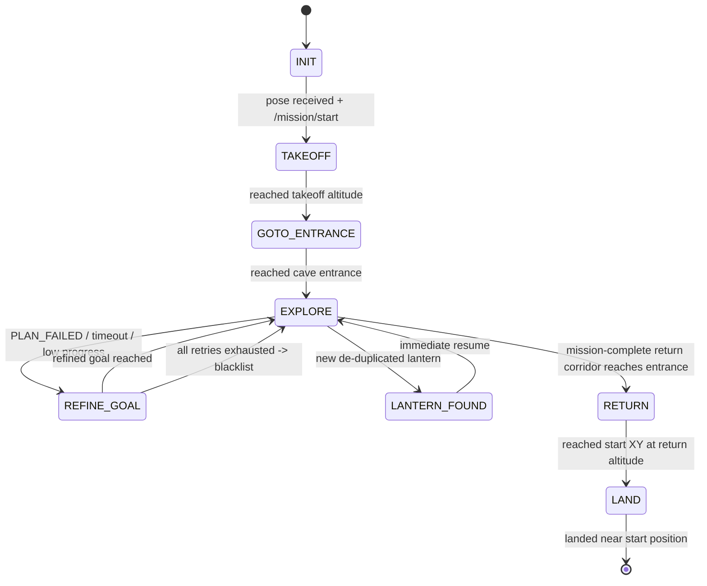
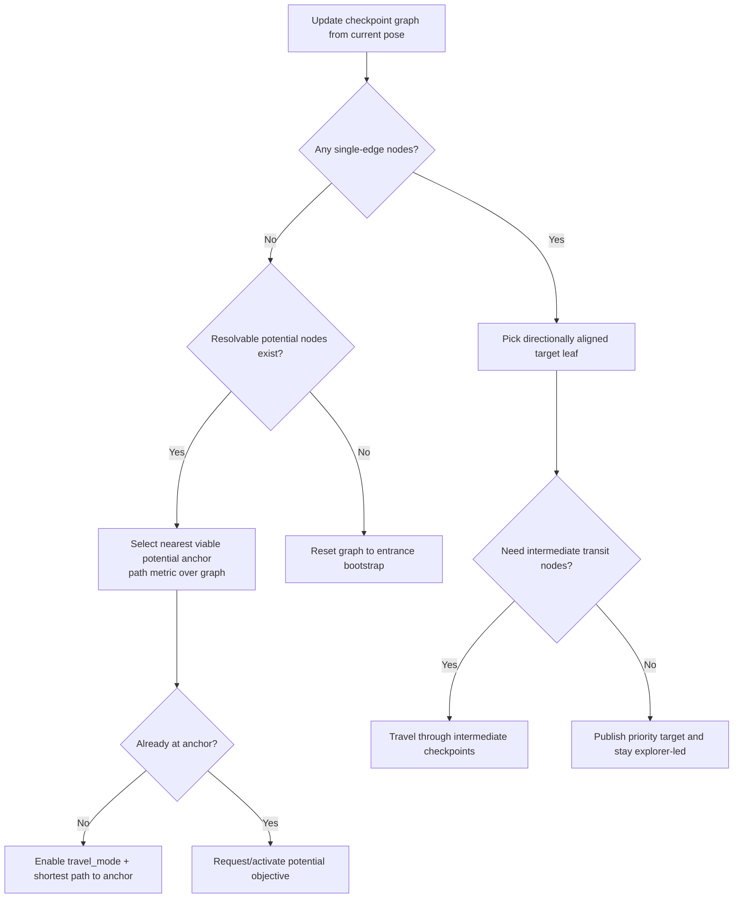

# FSM Package (`fsm`)

The `fsm` package contains the mission orchestrator node, `mission_fsm_node`, that coordinates the drone lifecycle from startup to landing.

At runtime, the node combines:

- an 8-state finite-state machine,
- asynchronous exploration-goal service requests,
- planner feedback handling,
- multi-layer recovery (stuck/timeout/Z-retry/frozen-watchdog), and
- a macroplanning checkpoint graph for robust cave traversal.

---

## 1) Mission state machine



### State semantics

1. **`INIT`**: Waits for both `/current_state_est` and `/mission/start`.
2. **`TAKEOFF`**: Sends a waypoint path to current XY and `current_z + takeoff_altitude`.
3. **`GOTO_ENTRANCE`**: Sends a waypoint path to the fixed entrance `[-320, 10, 18]`.
4. **`EXPLORE`**: Main autonomous phase (service-driven goals + macroplanning logic).
5. **`REFINE_GOAL`**: Retries same XY with alternate Z levels.
6. **`LANTERN_FOUND`**: Triggered by a new (de-duplicated) lantern detection; immediately returns to `EXPLORE`.
7. **`RETURN`**: Uses planner to fly to start XY at takeoff altitude.
8. **`LAND`**: Publishes direct trajectory to initial start pose.

> Mission completion is currently configured as `TARGET_LANTERN_COUNT = 1`.

---

## 2) Command and planner routing

### Exploration goal ingress

- Goals are requested from `/exploration/get_goal` (`exploring/srv/GetExplorationGoal`).
- The node enforces request latching and stale-response protection using:
  - `goal_request_pending_`,
  - `goal_request_timeout_s`,
  - `explorer_request_epoch_`,
  - `explorer_mode_suspended_for_travel_`.

### Planner topic selection

- `planner_type == "RRT"` → `/planner/goal`
- `planner_type == "A_star"` → `/planner_a/goal`
- Planner status feedback is consumed from `/planner/status`.

Macroplanning travel/potential goals are always sent via the RRT goal topic (`/planner/goal`) so travel-mode and waypoint-monitor logic remain consistent.

---

## 3) Recovery and robustness behaviors

### Z-retry refinement (`REFINE_GOAL`)

On `PLAN_FAILED`, hard timeout, or stuck/low-progress detection, the node enters `REFINE_GOAL` and retries altitudes generated around the current goal Z:

- parameters: `z_retry_max_attempts`, `z_retry_step`,
- pattern: center, then alternating lower/higher heights,
- on exhaustion: goal is blacklisted through `/exploration/blacklist_goal`.

### Exploration goal-selection watchdog

While in `EXPLORE`, FSM tracks:

- consecutive failed goal requests,
- elapsed time since last successful activation.

If thresholds are exceeded (`explore_goal_selection_timeout`, `explore_goal_selection_max_failures`), the node warns and keeps trying.

### Frozen watchdog fallback

When in `EXPLORE`/`REFINE_GOAL`, if motion stays within `freeze_reset_distance_threshold` for `freeze_timeout_s`, FSM:

- cancels current execution,
- resets transient exploration/travel objective state,
- preserves macroplanning graph structure,
- restarts exploration ownership cleanly.

### Waypoint-level macroplanning guard (RRT)

For travel/potential objectives, the node caches planner waypoints (`waypoints`) and checks nearby sampled obstacle points. If the next waypoint appears blocked (`waypoint_obstacle_clearance`), it cancels and attempts controlled reactivation/fallback.

---

## 4) Macroplanning checkpoint graph

When `macroplanning_enabled=true`, FSM maintains a graph of checkpoint nodes inferred from flight progress and depth cloud observations.

### Graph concepts

- **Checkpoint nodes** (`graph_nodes_`): center position, adjacency edges, visit count.
- **Potentials**: candidate exploration directions anchored to nodes.
- **Travel mode**: deterministic traversal along shortest-path node sequences.
- **Single-edge policy**: special handling for corridor/leaf structures with:
  - `/exploration/priority_target` (encourage exploration direction),
  - `/exploration/punishment_target` (discourage immediate backtracking).

### High-level decision flow



### Mission-complete return corridor

After enough lanterns are found, the node first attempts to return to cave entrance through the checkpoint graph (`start_return_to_entrance_via_travel`). If corridor synthesis fails, it falls back directly to `RETURN`.

---

## 5) ROS interfaces

### Subscriptions

- `/current_state_est` (`nav_msgs/msg/Odometry`)
- `/detected_lanterns` (`geometry_msgs/msg/PoseStamped`)
- `/planner/status` (`std_msgs/msg/String`)
- `/mission/start` (`std_msgs/msg/Empty`)
- `/exploration/map_ready` (`std_msgs/msg/Bool`)
- `/camera/depth/points_world` (`sensor_msgs/msg/PointCloud2`)
- `waypoints` (`nav_msgs/msg/Path`) — planner path monitor for travel/potential execution

### Publications

- `/command/trajectory` (`trajectory_msgs/msg/MultiDOFJointTrajectory`)
- `waypoints` (`nav_msgs/msg/Path`) — direct waypoint-path commands (takeoff/entrance)
- `/fsm/cancel` (`std_msgs/msg/Empty`)
- `/fsm/state` (`std_msgs/msg/String`)
- `/planner/goal` (`geometry_msgs/msg/PoseStamped`)
- `/planner_a/goal` (`geometry_msgs/msg/PoseStamped`)
- `/enable_mapping` (`std_msgs/msg/Bool`)
- `/exploration/blacklist_goal` (`geometry_msgs/msg/PointStamped`)
- `/exploration/priority_target` (`geometry_msgs/msg/PointStamped`)
- `/exploration/punishment_target` (`geometry_msgs/msg/PointStamped`)
- `/fsm/drone_marker` (`visualization_msgs/msg/Marker`)
- `/fsm/checkpoint_markers` (`visualization_msgs/msg/MarkerArray`)

### Service clients

- `/exploration/get_goal` (`exploring/srv/GetExplorationGoal`)

---

## 6) Parameters exposed by `mission_fsm_node`

Core mission and exploration:

- `planner_type` (`A_star` default in node, overridden in mission launch)
- `takeoff_altitude`
- `lantern_dedup_threshold`
- `min_exploration_goal_distance`
- `replan_interval_s`

Goal-selection and request watchdog:

- `explore_goal_selection_timeout`
- `explore_goal_selection_max_failures`
- `goal_request_timeout_s`

Refinement and stuck handling:

- `z_retry_max_attempts`
- `z_retry_step`
- `freeze_reset_distance_threshold`
- `freeze_timeout_s`

Macroplanning graph and potentials:

- `macroplanning_enabled`
- `nodes_distance`, `node_radius`
- `max_potential_node_range`
- `potential_node_backoff_distance`
- `potential_angle_threshold_deg`
- `potential_filter_match_distance`
- `potential_filter_min_observations`
- `potential_filter_observation_timeout_s`
- `seen_point_timeout_s`
- `force_explorer_timeout_s`
- `single_edge_priority_reached_radius`
- `waypoint_obstacle_clearance`

### Default overrides in `launch/mission.launch.py`

- `planner_type:=RRT`
- `takeoff_altitude:=5.0`
- `min_exploration_goal_distance:=3.0`
- `z_retry_max_attempts:=5`
- `z_retry_step:=2.0`

---

## 7) Launch and operation

Run the integrated mission stack:

```bash
ros2 launch fsm mission.launch.py
```

Example overrides:

```bash
ros2 launch fsm mission.launch.py planner_type:=A_star takeoff_altitude:=4.0
ros2 launch fsm mission.launch.py record_bag:=true bag_filename:=mission_run
```

Trigger mission start:

```bash
ros2 topic pub --once /mission/start std_msgs/msg/Empty "{}"
```
