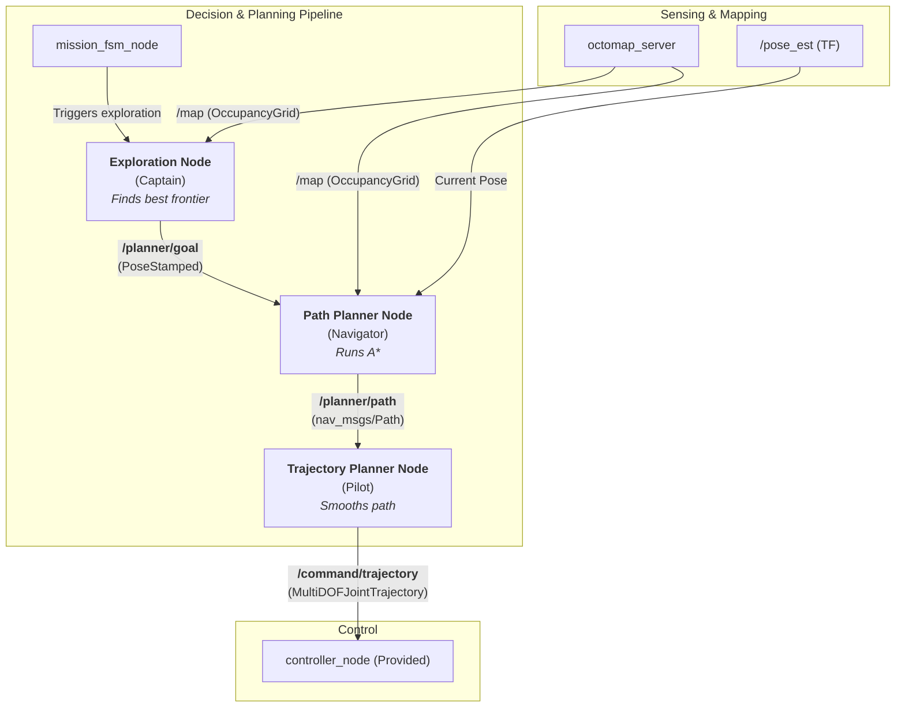
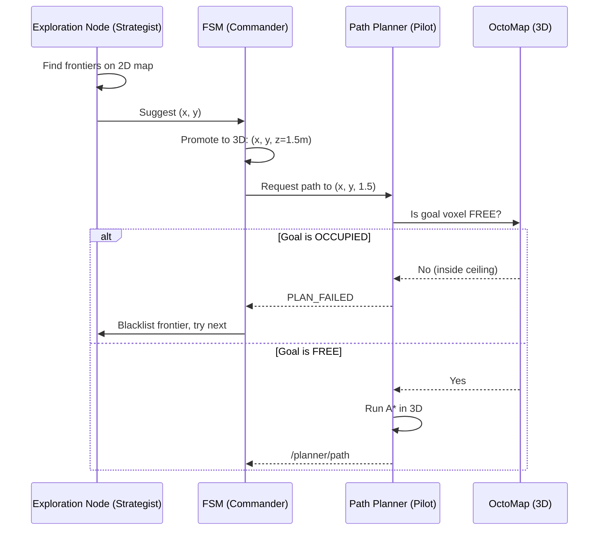

# Planning Package

This package contains the path planning and exploration logic for the autonomous drone project.

## Architecture



## Nodes

### 1. `exploration_manager`
*   **Purpose**: Manages the autonomous exploration of the environment using a Frontier-Based strategy.
*   **Functionality**:
    *   Determines exploration goals (frontiers between known and unknown space).
    *   Publishes 2D strategic goals for the FSM to promote to 3D.
    *   Publishes the current exploration status.

---

## Theoretical Foundation: Frontier-Based Exploration

Our exploration strategy is based on the **"Foundation and Polish"** approach:
*   **80% of the code** is based on the classic **Yamauchi (1997)** paper.
*   **20% of the code** is inspired by the state-of-the-art **EFP (Zhang et al., 2024)** paper.

### Paper 1: The Foundation (Yamauchi 1997)

> Yamauchi, B. (1997). *A frontier-based approach for autonomous exploration*.

This is our primary implementation guide. It is simple, robust, and directly applicable.

#### Key Concepts Taken:

1.  **Core Definition of a Frontier:**
    *   A frontier is the boundary between "known free" space and "unknown" space.
    *   **Implementation:** Iterate through the 2D `OccupancyGrid` from `octomap_server`. Find all pixels with value `0` (free) that are adjacent to pixels with value `-1` (unknown).

2.  **Greedy Navigation Strategy:**
    *   The robot moves to the **nearest frontier** to gain the most information efficiently.
    *   **Implementation:** Initial scoring function: `score = 1 / distance_from_drone`.

3.  **Continuous Exploration Cycle:**
    *   Exploration is a continuous cycle of sensing, planning, and moving.
    *   **Implementation:** The FSM's `EXPLORE` state triggers the exploration node, which plans a path to a frontier. Once reached, the map updates, and the cycle repeats.

### Paper 2: The Polish (EFP Zhang 2024)

> Zhang, H., et al. (2024). *EFP: Efficient Frontier-Based Autonomous UAV Exploration Strategy for Unknown Environments*.

This paper provides modern heuristics to improve the basic approach.

#### Key Concepts Taken:

1.  **Motion Consistency Cost (The "Yaw" Penalty):**
    *   A frontier that requires a 180° turn is less efficient than one directly ahead.
    *   **Implementation:** Upgrade the scoring function:
        ```
        cost = distance + (yaw_difference * weight)
        score = 1 / cost
        ```

2.  **Frontier Clustering:**
    *   Raw frontier pixels are noisy. Grouping them creates stable goals.
    *   **Implementation:** Use OpenCV's `findContours()` to group adjacent frontier pixels into blobs. Calculate the centroid of each contour.

3.  **Global View Justification (For the Report):**
    *   EFP uses a TSP solver for global optimization. We **do not implement this** (too complex), but we justify our greedy approach in the written report: *"We opted for a reactive, greedy approach to ensure robustness and reduce computational load."*

---

## The 2.5D Planning Strategy

> **The Core Principle:** Plan Strategy in 2D (fast), Plan Path in 3D (safe).

A naive 2D path will cause the drone to crash into the floor or ceiling. The solution is a hybrid "2.5D" approach.

### The Three-Step Process: Suggest → Promote → Validate



#### Step 1: `exploration_node` (The Strategist)
*   Lives in the 2D world. Knows nothing about height.
*   **Input:** 2D `OccupancyGrid` (`/map`).
*   **Output:** A simple 2D `geometry_msgs/Point` on `/exploration/strategic_goal`. It says: *"I suggest we investigate (x, y)."*

#### Step 2: FSM (The Commander)
*   The bridge between 2D strategy and 3D reality.
*   **Input:** `/exploration/strategic_goal`.
*   **Action:** Promotes the 2D point to a full 3D `PoseStamped`. **The Z-value is added here.**
    ```python
    # Inside the FSM
    full_3d_goal.pose.position.x = strategic_goal.x
    full_3d_goal.pose.position.y = strategic_goal.y
    full_3d_goal.pose.position.z = 1.5  # <-- THE Z-VALUE
    ```
*   **Output:** `geometry_msgs/PoseStamped` on `/planner/goal`.

#### Step 3: `path_planner_node` (The Pilot & Safety Officer)
*   Lives in the full 3D world. **Operates on the 3D Voxel Grid from OctoMap, not the 2D projection.**
*   **Input:** The 3D goal and the 3D OctoMap.
*   **Action:**
    1.  **Validation (O(1) Check):** Is the goal voxel `FREE`? If `OCCUPIED` or `UNKNOWN`, fail immediately.
    2.  **Pathfinding:** Run A* through the 3D voxel grid.
*   **Output:** A 3D `nav_msgs/Path`.

### The Smart Voxel Occupancy Check (Critical Optimization)

Without this check, A* runs in worst-case mode (visits every voxel) before failing. With it, the failure is instantaneous.

```cpp
// Inside path_planner_node callback (C++)
octomap::OcTree* tree = ...;
octomap::point3d endpoint(goal.x, goal.y, goal.z);
octomap::OcTreeNode* node = tree->search(endpoint);

if (node != NULL && tree->isNodeOccupied(node)) {
    // Goal is inside a wall! Fail IMMEDIATELY.
    publishStatus("PLAN_FAILED");
    return;
}
// If here, goal is valid. Now run A*.
```

*   **Without check:** ~2-8 second delay per failure.
*   **With check:** Milliseconds (instantaneous feel).

---

## Failure Handling: Low Ceilings

What happens if the cave ceiling lowers to 1.0m?

1.  `exploration_node` suggests `(x, y)` (unaware of low ceiling).
2.  FSM promotes to `(x, y, 1.5)`.
3.  `path_planner_node` sees that voxel `(x, y, 1.5)` is `OCCUPIED`.
4.  Planner returns `PLAN_FAILED` instantly.
5.  FSM tells `exploration_node`: *"Blacklist that frontier, give me the next-best one."*

---

### 2. `global_planner` (Planned)
*   **Purpose**: Computes collision-free paths from the drone's current position to a goal.
*   **Functionality**:
    *   Subscribes to the global map (Octomap).
    *   Implements A* or RRT* path finding algorithms.
    *   Provides a service or subscribes to goal topics to generate a `nav_msgs/Path`.

## Dependencies
*   `rclcpp`
*   `geometry_msgs`
*   `nav_msgs`
*   `octomap_msgs`
*   `visualization_msgs`
*   `tf2` / `tf2_ros`
